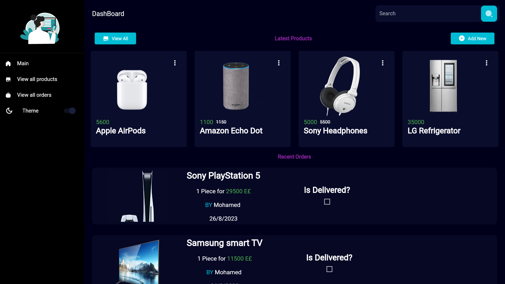
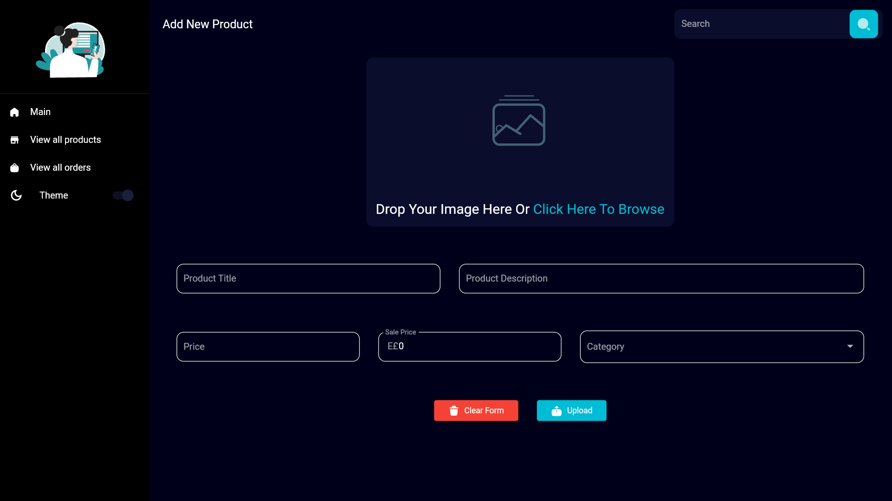
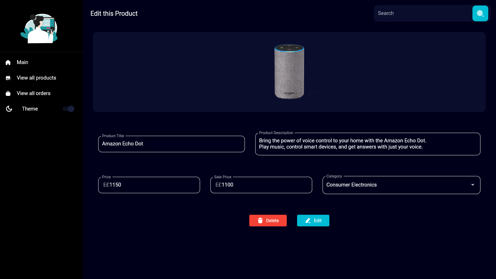
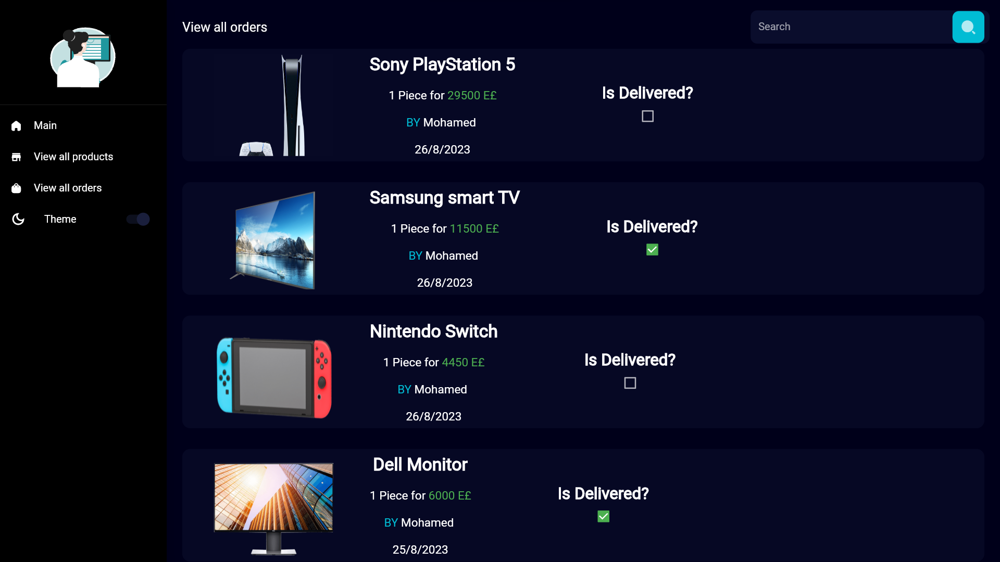
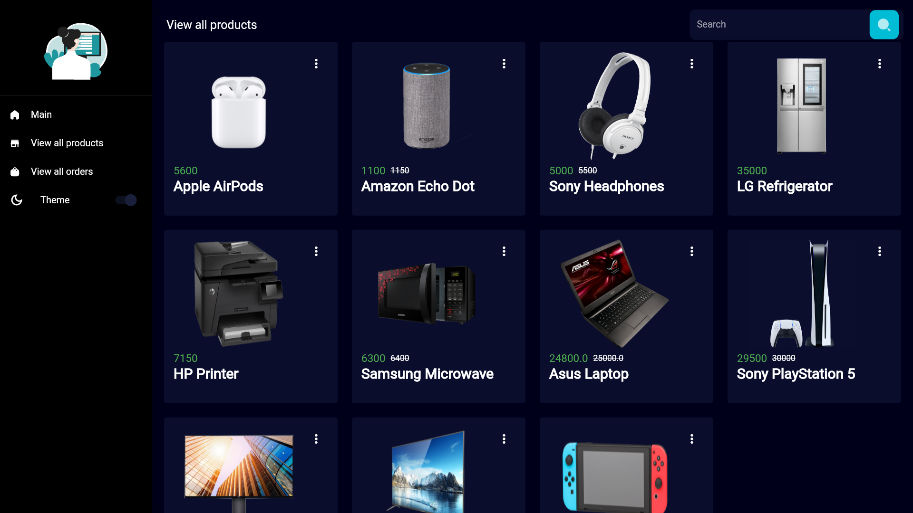

# Admin Panel 

Welcome to the Admin Panel repository. This admin panel is designed to manage products and orders for your application.

## Screenshots

### Main Screen

### Add Product

### Edit Product

### All Orders Screen

### All Products Screen

## Features

- Manage products: Add, edit, and delete products.
- View and manage orders: See all orders and their details.
- User-friendly interface: Intuitive and easy-to-use interface.

## Getting Started

1. Clone the repository: `git clone https://github.com/your-username/admin-panel.git`
2. Install dependencies: `npm install`
3. Configure Firebase credentials in `src/firebaseConfig.js`.
4. Run the development server: `npm start`

## Technologies Used

- Flutter

## License

This project is licensed under the MIT License - see the [LICENSE](LICENSE) file for details.
