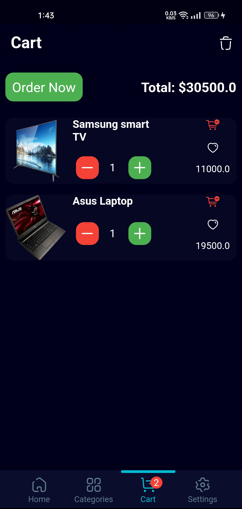
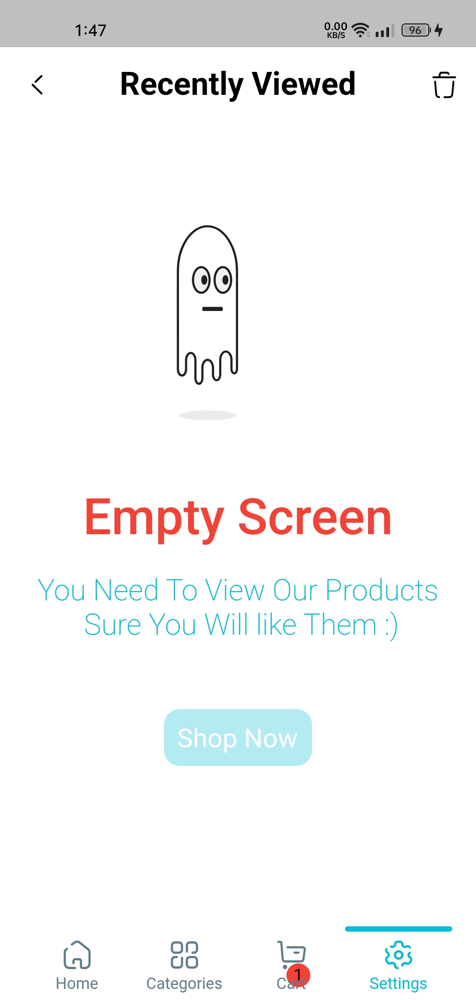

# Your Mobile App Name

Welcome to the official repository of Your Mobile App Name! This app is a B2C mobile application that allows users to explore and purchase electronic products while enjoying discounts. The app supports both dark and light modes, as well as Arabic and English languages.

## Features

- Browse a wide range of electronic products.
- View products on sale and take advantage of discounts.
- Explore products by categories.
- Add products to your cart for easy purchasing.
- Customize app settings based on your preferences.
- Create and manage a wishlist of your favorite products.
- Review products and leave feedback.
- View previously browsed products in the Viewed Products section.

## Screenshots

### Home and On Sale Products Screens
 

### All Products and Cart Screens 
  

### All Categories Screens and Specific Category
 

### Settings and Wishlist Screens
 

### Product and Viewed Products Screens
 

### Empty Screens
 
 

## Getting Started

1. Clone this repository to your local machine.
2. Follow the installation instructions in the [Installation Guide](docs/installation-guide.md).
3. Run the app on your preferred development environment.

## License

This project is licensed under the [Your License Name](LICENSE).

---

Happy shopping with My Mobile App! Feel free to explore, contribute, and provide feedback.
